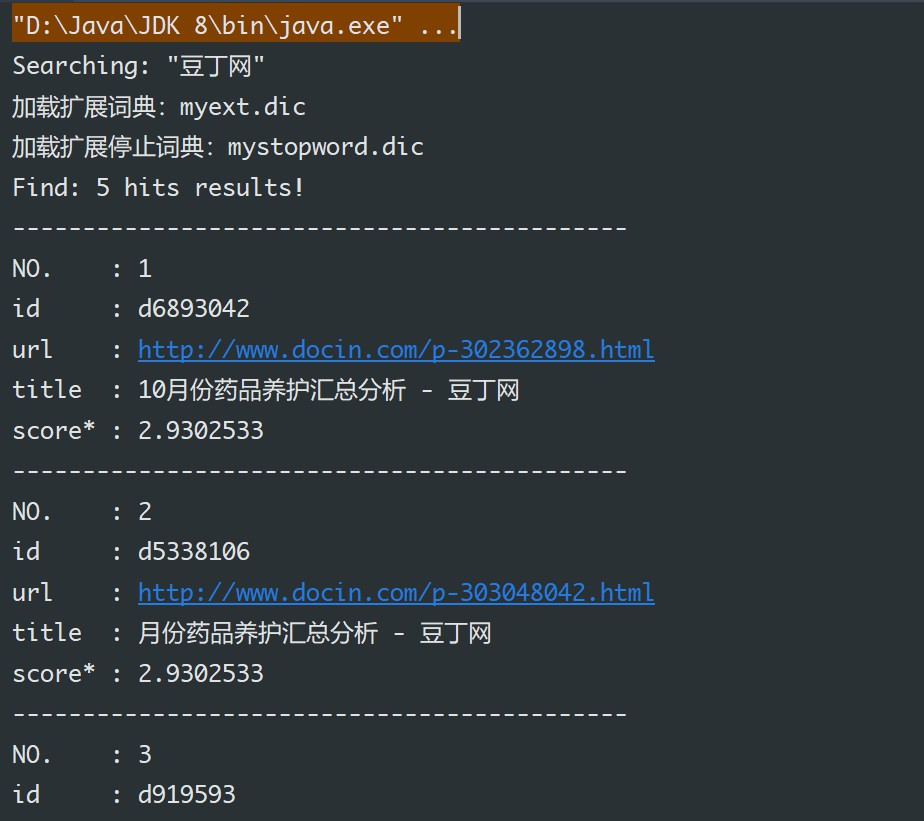

# Webinfo Lab1 -  Information Retrieval

## Intro

For Webinfo 2019 in USTC - Lab1

## Info

## Project Framework

Lucene + Java ? (not sure... probably OK ?)

### Build Environment

IntelliJ Idea + JDK 8

### Dependencies

+   JDK 8
+   Lucene 8.2.0
+   IKAnalyzer-5.0.2

### How to use

1.  Add required dependencies to your Java Project
2.  Set codes in class `Main`
3.  run `public static void main()` in class `Main`

## Design

## TODOS

+   中文分词 √ 采用 IK
+   文档排序 □
+   测试格式化输出模块 `Work()` □
+   设置自定义词典 myext.dic □ (用于优化结果)
+   针对测试数据的优化（如设置词典）□
+   引入其他分词工具，如 jieba □ 
+   查询模块 √ 目前可以输出结果到 Terminal

## Discussion

### 1 中文分析器是否使用？选择？

+   IK
+   ICTCLAS

### 2 文档排序实现？

+   Lucene - Sort 功能
+   结合相关性
+   这是一个**重点问题**

## References

[**Apache LuceneTM 8.3.0 Documentation**](https://lucene.apache.org/core/8_3_0/index.html)

[Lucene 8.3.0 Demo](https://lucene.apache.org/core/8_3_0/demo/overview-summary.html)

[Lucene Tutorial - old](https://www.yiibai.com/lucene/lucene_environment.html)

[**Lucene介绍与使用**](https://blog.csdn.net/weixin_42633131/article/details/82873731)

[Lucene安装及环境配置](https://blog.csdn.net/u013819513/article/details/79733756)

[Lucene 全文检索入门](https://www.cnblogs.com/cnjavahome/p/9192467.html)

[Lucene系列（一）快速入门](https://segmentfault.com/a/1190000014203843)

[Apache Lucene全局搜索引擎入门教程](https://www.jianshu.com/p/48aad01ebc7c)

[Lucene 五分钟教程 ](http://www.sohu.com/a/196235775_355142)

[lucene-相关度排序](https://blog.csdn.net/qq_33301113/article/details/79200791)

[Lucene--相关度排序和中文分析器](https://www.jianshu.com/p/89ef0b892c56)