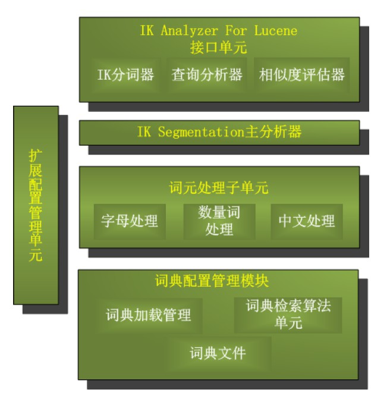
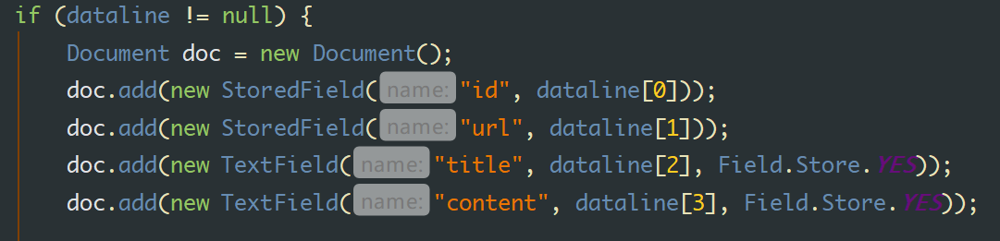
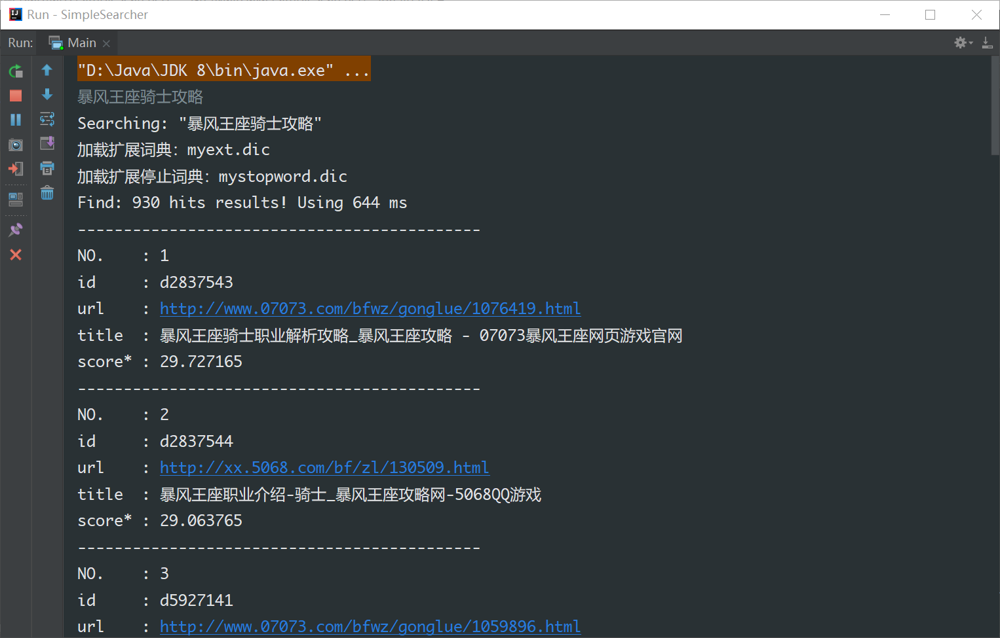
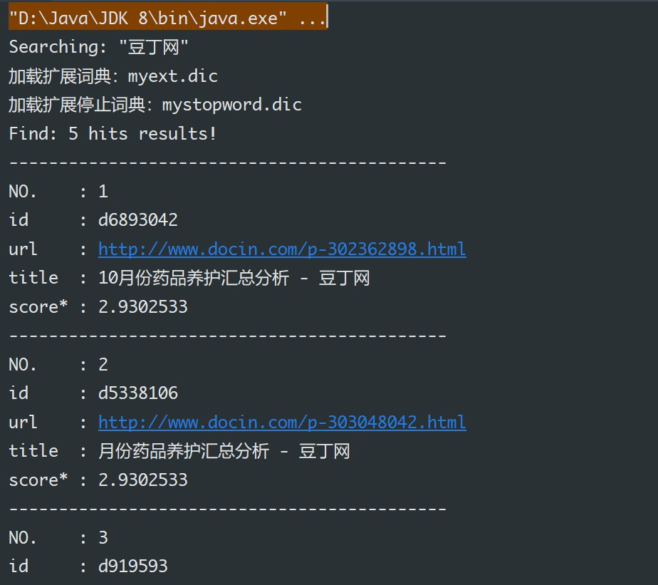

# Web 信息处理与应用 实验1：信息检索

## 介绍

本项目为 USTC “Web信息处理与应用” 的课程实验，实验总体要求：给定若干数量的文档和查询条件，请为每个查询条件返回前20条最相关的文档。其中，每条文档与查询条件的相关性评级取值为{0, 1, 2, 3}，3为最相关，0为不相关。返回结果将通过F1值与NDCG@20进行评价。

## 成员

**陈昂 PB17061250**

**赵家兴 PB17111625**

## 项目框架

Lucene + Java

### 环境

IntelliJ Idea + JDK 8

### 依赖

+   JDK 8
+   Lucene 8.2.0
+   IKAnalyzer-5.0.2

### 如何使用本项目代码

1.  克隆[本项目代码]( https://github.com/Censyu/WebInfo-Lab-Archive )到本地
2.  向 Java 项目里添加依赖
3.  在 `Main` 类里设置代码（参见代码注释）
4.  运行类 `Main` 中的 `public static void main()` 

## 实验设计

### 工具

采用 Lucene 引擎 + IK 中文分词工具 (Java 实现)

代码均在 [GitHub]( https://github.com/Censyu/WebInfo-Lab-Archive ) 上存档

### 中文分词

在仓库的 `lib/IKAnalyzer-5.0.2.jar` 使用了**针对新版本 Lucene 优化的 IK 中文分词器**。

IK Analyzer 是一个开源的，基于 java 语言开发的轻量级的中文分词工具包。在 2012 版本中， IK 实现了简单的分词歧义排除算法，标志着 IK 分词器从单纯的词典分词向模拟语义分词衍化。它支持 “正向迭代最细粒度切分算法”，支持细粒度和智能分词两种切分模式。

在类 `IndexBuilder` 和 `Searcher` 中均用到中文分词，分别用于拆分文档内容和拆分查询内容，具体来说 IK 分词器会首先加载自定义的词典和停用词表（在后面优化部分会设置），然后接收一个字符串输入，进行分词，输出一个记号列表，用于后面的使用。这里使用的是 IK 只能切分模式，对部分名词的切分比较合理。

### 索引构建和文档排序

索引构建在 `IndexBuilder` 这个类中实现，主方法为 `BuildIndex()` ，首先需要为该类创建一个实例变量，在构造方法中进行初始化，包括：创建一个 RAM 文档库，创建一个 IK 分词器实例，创建文件读写器

随后调用方法 `BuildIndex()` ，根据实现设定的文档集合，首先对其解析，得到以行为单位的文档集合，包含 id、url、标题、内容，四个域，其中后两个域要作为索引查询域，前两个不进行查询。

随后对标题和文档分别进行分词，**通过计算 tf - idf 进行排序**，并以此**构建索引**，完成后，将索引从 RAM 存储到磁盘指定位置，用于后续查询使用。

### 文档查询

文档查询功能在类 `Searcher` 中实现，和前面的索引构建相似，在构造函数中完成初始化：打开索引库，创建 IK 分词器实例等

这里分别实现了单次查询和通过文件输入查询集输出结果集。分别在方法 `Search(String keyword)` 和 `Work()` 中实现。但后者仅比前者多了解析和格式化的操作。

对于查询过程，首先将查询输入通过分词器进行拆分，得到一系列关键词项，然后**按照布尔查询的 “与” 模式**，访问索引的倒排表，得到查询结果，并输出所有查询到结果的数目，**然后 Lucene 内部实现的相关性权重计算综合考虑了每个词项 tf 和 df**，默认情况下，每个数据域（这里是标题和内容）的权重均为 1.0 ，然后**使用向量空间模型**的方法，给每个查询结果进行打分。

这里计算结果得分后进行排序，然后输出前 20 个最相关的文档作为结果显示或输出，如：

### 索引、查询优化

在最初的程序测试中很快就发现了中文分词的效果很差，尤其是对一些人名和专有名词，然后我考虑使用 python 的 jieba 分词器和 ICTCLAS 分词器，但是效果基本相似。因此针对这方面的考虑采用**人工设置自定义词库**的方法，针对特定的输入进行优化，在第一次 submission 中效果不错。进一步还可以考虑对相关性权重进行优化，或者引入搜狗输入法的海量词库进行优化（不过感觉有点冗杂）。

另一方面是 IK 分词器在遇到使用加号分隔的英文串时无法正确划分，因此在遇到查询中 url 时不能正确处理，同时因为上面没有将 url 设置为查询域，也不能查到url 中的有效信息，针对这个问题的解决办法是**遇到 url 单独处理**，不通过分词查询的方式，而是按加号分割，并按得到的关键词搜索 url、标题和内容三个域，最后合并结果。

在平台上提交了测试结果，得分如下，文件见附件：

## 各方面的实现总结

+   中文分词 :ballot_box_with_check: (采用 IK)
+   文档排序 ⬜️ （内置了文档排序）
+   测试格式化输出模块 `Work()` :ballot_box_with_check:
+   设置自定义词典 myext.dic :ballot_box_with_check: (用于优化结果，效果良好)
+   针对测试数据的优化（如设置词典）:ballot_box_with_check:
+   引入其他分词工具，如 jieba  ​ :x: (不需要，IK已经足够)​
+   查询模块 :ballot_box_with_check: (目前可以输出结果到 Terminal，也可以格式化输出)

## 参考文档

[**Apache LuceneTM 8.3.0 Documentation**](https://lucene.apache.org/core/8_3_0/index.html)

[Lucene 8.3.0 Demo](https://lucene.apache.org/core/8_3_0/demo/overview-summary.html)

[Lucene Tutorial - old](https://www.yiibai.com/lucene/lucene_environment.html)

[**Lucene介绍与使用**](https://blog.csdn.net/weixin_42633131/article/details/82873731)

[Lucene安装及环境配置](https://blog.csdn.net/u013819513/article/details/79733756)

[Lucene 全文检索入门](https://www.cnblogs.com/cnjavahome/p/9192467.html)

[Lucene系列（一）快速入门](https://segmentfault.com/a/1190000014203843)

[Apache Lucene全局搜索引擎入门教程](https://www.jianshu.com/p/48aad01ebc7c)

[Lucene 五分钟教程 ](http://www.sohu.com/a/196235775_355142)

[lucene-相关度排序](https://blog.csdn.net/qq_33301113/article/details/79200791)

[Lucene--相关度排序和中文分析器](https://www.jianshu.com/p/89ef0b892c56)