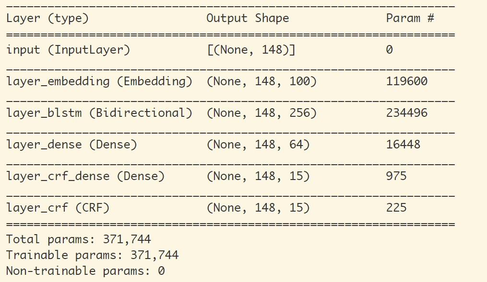
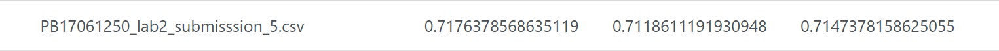

# Webinfo Lab2 -  命名实体识别

## Info


## Design

【算法调研和比较……】

### 实现

#### 工具

这里使用 python 语言以及 `kashgari` 这个库。`kashgari` 提供了一个基于 TensorFlow 的 NLP 框架，包含了命名实体识别常见的几种模型（`CNN-LSTM`，`BiGRU`，`BiLSTM`，`BiLSTM+CRF`），并且可以使用 `bert` 预训练模型来实现迁移学习。

依赖项：

+   tensorflow 1.14.0
+   kashgari 1.0.0
+   seqeval 0.0.10

#### 尝试 Bert

在最初的调研阶段发现 bert 模型在 NLP 的各个问题都有很好的效果，因此考虑使用预训练模型，下游任务使用 BiLSTM + CRF ，从而进行命名实体识别。在使用 `kashgari` 的情况下只需要在代码中加入：

```python
# 加载 Bert 预训练模型
embedding = BERTEmbedding('chinese_L-12_H-768_A-12', 128)

# 使用 BiLSTM - CRF 模型
model = BiLSTM_CRF_Model(embedding)
```

但是后来在训练之后发现本题目是关于医疗领域（或者更确切地说是电子病历的实体识别），使用这个与训练模型可能效果并不是很好

最后经过比较多种模型，决定使用结果相对好的 `BiLSTM + CRF` 模型

#### 数据预处理

首先需要将 json 封装的对象格式解析为使用 B-I-O 标注的序列数据，注意到提供的数据中entities 是按 start 属性升序排列的。因此做法就很简单，只需要顺序判断每个字符所在实体位置，追加标签输出即可。这部分代码在 `formatter.py` 中。

>   注：在随后的训练及测试过程中发现直接将每个 json 对象的 originalText 作为序列的基本单位效果不好，因此需要将原始字段按**句**进行拆分，具体做法是通过句号切分，并在每句的后面加一个空行

#### 准备训练数据

接下来需要将提供的数据进行切分，按照 10:1:1 的比例随机划分为训练集、验证集和测试集，这个过程将随机尝试多次，分别进行训练，最后取最好的效果

#### 训练和预测

使用上面准备好的数据进行训练，训练模型和模型保存的代码在 `train.py` 中

主要代码只有下面这一句，其含义很显然：

```python
model.fit(train_x,
        train_y,
        x_validate = validate_x,
        y_validate = validate_y,
        epochs = epochs,
        batch_size = batch_size)
```

超参数使用模型默认值即可。

对于训练轮数以及 batch 大小在最初几次测试中发现，如果 batch 太大（如50及以上）会使模型很快进入过拟合，前两轮准确率还在 90% 以上，三轮后立刻掉到 20% 左右并且越来越低。

此外，训练轮数也不适合太多，因为训练过度很容易在实体划分的边界出现问题。

比如，训练数据会把一些标点符号算入某些实体中，并且更严重的问题是疾病名和解剖部位名会有重合、手术名包含解剖部位名等问题，在训练次数增加时实体划分倾向于向更小的单位进行划分。

另外一个问题是给的训练数据太少（400），需要预测的数据有另外 600 条，因此效果可能不会很好。

最后进行训练，模型参数如下：



经过反复调参和尝试之后，发现 epoch=3，batch_size=32 时效果比较好

随后根据这个模型进行预测，这部分代码在 `generate.py` 中：

读取测试数据，将文本按句切分，记录每句的起始偏移，然后分别对每句进行预测，最后将得到的实体格式化保存到文件即可。

```
text = data['originalText']
slist = text.split('。')
pred_results = model.predict_entities(slist)
```

>   注：使用 BiLSTM + CRF 模型预测时会产生 `<PAD>` 这种标签，对于这种一种处理方法是直接丢弃，否则在产生结果时会混入很多无效数据，使得准确率降低 

#### 尝试优化

除了在上面提到的几种优化处理（尝试bert，原始文本按句切分，调整模型参数，丢弃无效标签）外，在观察预测结果后发现：有很多预测结果与正确结果之间仅相差一个字符（而且通常是结尾少一个标点符号），对于这种情况一种粗暴的处理方法是判断后面是否紧随一个右括号，如果是就把它加进去。

此外，还对一些数据进行人工检查和标注（......至少对于 600 的数据量还是比较有效的）

最后得到的分数如下：



