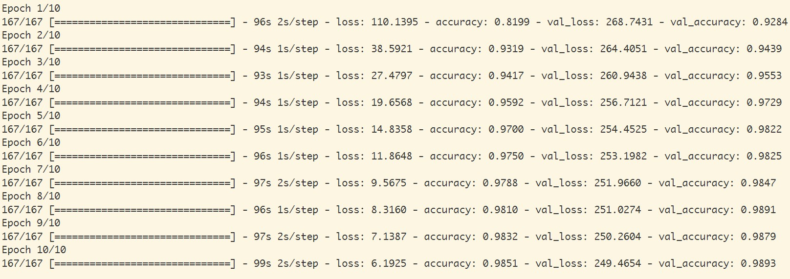

# Webinfo Lab2 -  命名实体识别

**陈昂 PB17061250**

**赵家兴 PB17111625**

## Info

本项目为 USTC “Web信息处理与应用” 的课程实验。

实验总体要求：给定若干数量的医疗文档，其中，每条文档含有数量不一的医疗相关命名实体。具体包括六类命名实体：疾病与诊断、检查、检验、药物、手术、解剖部位。请为给定的每条医疗文档，找出其中所有属于上述六类的医疗命名实体，并准确判断其类别。

## Design

### 算法调研和比较

接下来解析三种NLP 模型：**CRF**，**Bi-LSTM**，**Bi-LSTM+CRF**。首先给出在[此人](https://zhuanlan.zhihu.com/p/61227299?tdsourcetag=s_pctim_aiomsg)所使用的数据集和环境下，以上四种模型所给出的最高准确率：

- CRF: 95.43%
- BiLSTM: 95.44%
- BiLSTM+CRF: 95.75%

我们的实现就是基于 **BiLSTM+CRF** 的。

#### 隐马尔科夫模型（HMM）到条件随机场（CRF）

隐马尔可夫模型描述由一个隐藏的马尔科夫链随机生成不可观测的状态随机序列，再由各个状态生成一个观测而产生观测随机序列的过程。隐马尔可夫模型由初始状态分布，状态转移概率矩阵以及观测概率矩阵所确定。

- 初始状态分布：每一个标注作为句子第一个字的标注的概率
- 状态转移概率矩阵：由某一个标注转移到下一个标注的概率
- 观测概率矩阵：在某个标注下，生成某个词的概率

HMM 的训练过程，是根据训练数据根据最大似然的方法估计模型的三个要素，即上文提到的初始状态分布、状态转移概率矩阵以及观测概率矩阵。模型训练完毕之后，利用训练好的模型进行维特比（viterbi）算法解码，就是对给定的模型未见过的句子，求句子中的每个字对应的标注。

HMM模型中存在两个假设，一是输出观察值之间严格独立，二是状态转移过程中当前状态只与前一状态有关。也就是说，在命名实体识别的场景下，HMM认为观测到的句子中的每个字都是相互独立的，而且当前时刻的标注只与前一时刻的标注相关。但实际上，命名实体识别往往需要更多的特征，比如词性，词的上下文等等，同时当前时刻的标注应该与前一时刻以及后一时刻的标注都相关联。由于这两个假设的存在，显然HMM模型在解决命名实体识别的问题上是存在缺陷的。

而条件随机场就没有这种问题，它通过引入自定义的特征函数，不仅可以表达观测之间的依赖，还可表示当前观测与前后多个状态之间的复杂依赖，可以有效克服HMM模型面临的问题。

#### 深度学习方法 Bi-LSTM（+CRF）

LSTM是依靠神经网络超强的非线性拟合能力，在训练时将样本通过高维空间中的复杂非线性变换，学习到从样本到标注的函数，之后使用这个函数为指定的样本预测每个token的标注。

简单的LSTM的优点是能够通过双向的设置学习到观测序列（输入的字）之间的依赖，在训练过程中，LSTM能够根据目标（比如识别实体）自动提取观测序列的特征，但是缺点是无法学习到状态序列（输出的标注）之间的关系，要知道，在命名实体识别任务中，标注之间是有一定的关系的，比如B类标注（表示某实体的开头）后面不会再接一个B类标注，所以LSTM在解决NER这类序列标注任务时，虽然可以省去很繁杂的特征工程，但是也存在无法学习到标注上下文的缺点。

相反，CRF的优点就是能对隐含状态建模，学习状态序列的特点，但它的缺点是需要手动提取序列特征。所以一般的做法是，在LSTM后面再加一层CRF，以获得两者的优点。

### 实现

#### 工具

这里使用 python 语言以及 `kashgari` 这个库。`kashgari` 提供了一个基于 TensorFlow 的 NLP 框架，包含了命名实体识别常见的几种模型（`CNN-LSTM`，`BiGRU`，`BiLSTM`，`BiLSTM+CRF`），并且可以使用 `bert` 预训练模型来实现迁移学习。

依赖项：

+   tensorflow 1.14.0
+   kashgari 1.0.0
+   seqeval 0.0.10

#### 尝试 Bert

在最初的调研阶段发现 bert 模型在 NLP 的各个问题都有很好的效果，因此考虑使用预训练模型，下游任务使用 BiLSTM + CRF ，从而进行命名实体识别。在使用 `kashgari` 的情况下只需要在代码中加入：

```python
# 加载 Bert 预训练模型
embedding = BERTEmbedding('chinese_L-12_H-768_A-12', 128)

# 使用 BiLSTM - CRF 模型
model = BiLSTM_CRF_Model(embedding)
```

但是后来在训练之后发现本题目是关于医疗领域（或者更确切地说是电子病历的实体识别），使用这个与训练模型可能效果并不是很好

最后经过比较多种模型，决定使用结果相对好的 `BiLSTM + CRF` 模型

#### 数据预处理

首先需要将 json 封装的对象格式解析为使用 B-I-O 标注的序列数据，注意到提供的数据中 entities 是按 start 属性升序排列的。因此做法就很简单，只需要顺序判断每个字符所在实体位置，追加标签输出即可。这部分代码在 `formatter.py` 中。

>   注：在随后的训练及测试过程中发现直接将每个 json 对象的 originalText 作为序列的基本单位效果不好，因此需要将原始字段按**句**进行拆分，具体做法是通过句号切分，并在每句产生的标注序列后面加一个空行

#### 准备训练数据

接下来需要将提供的数据进行切分，按照 10:1:1 的比例随机划分为训练集、验证集和测试集，这个过程将随机尝试多次，分别进行训练，最后取最好的效果

#### 训练和预测

使用上面准备好的数据进行训练，训练模型和模型保存的代码在 `train.py` 中

主要代码只有下面这一句，其含义很显然：

```python
model.fit(train_x,
        train_y,
        x_validate = validate_x,
        y_validate = validate_y,
        epochs = epochs,
        batch_size = batch_size)
```

超参数使用模型默认值即可。

对于训练轮数以及 batch 大小在最初几次测试中发现，如果 batch 太大（如50及以上）会使模型很快进入过拟合，前两轮准确率还在 90% 以上，三轮后立刻掉到 20% 左右并且越来越低。

此外，训练轮数也不适合太多，因为训练过度很容易在实体划分的边界出现问题。

比如，训练数据会把一些标点符号算入某些实体中，并且更严重的问题是疾病名和解剖部位名会有重合、手术名包含解剖部位名等问题，在训练次数增加时实体划分倾向于向更小的单位进行划分。

另外一个问题是给的训练数据太少（400），需要预测的数据有另外 600 条，因此效果可能不会很好。

最后进行训练，模型参数如下：


经过反复调参和尝试之后，发现 epoch=10，batch_size=32 时效果比较好

训练过程中结果如下：



随后根据这个模型进行预测，这部分代码在 `generate.py` 中：

读取测试数据，将文本按句切分，记录每句的起始偏移，然后分别对每句进行预测，最后将得到的实体格式化保存到文件即可。

```
text = data['originalText']
slist = text.split('。')
pred_results = model.predict_entities(slist)
```

>   注：使用 BiLSTM + CRF 模型预测时会产生 `<PAD>` 这种标签，对于这种结果，一种处理方法是直接丢弃，否则在产生结果时会混入很多无效数据，使得准确率降低 ，同时也提醒在这附近预测效果不好，可以进一步在这里针对性优化

#### 尝试优化

除了在上面提到的几种优化处理（尝试bert，原始文本按句切分，调整模型参数，丢弃无效标签）外，在观察预测结果后发现：有很多预测结果与正确结果之间仅相差一个字符（而且通常是结尾少一个标点符号），对于这种情况一种粗暴的处理方法是判断后面是否紧随一个右括号，如果是就把它加进去。

因为之前尝试了多种模型，考虑到不同的模型侧重点会有所不同，最后结果根据多种模型加权融合得到。

此外，还对一些数据进行人工检查和标注（......至少对于 600 的数据量还是比较有效的）

最后得到的分数如下：


